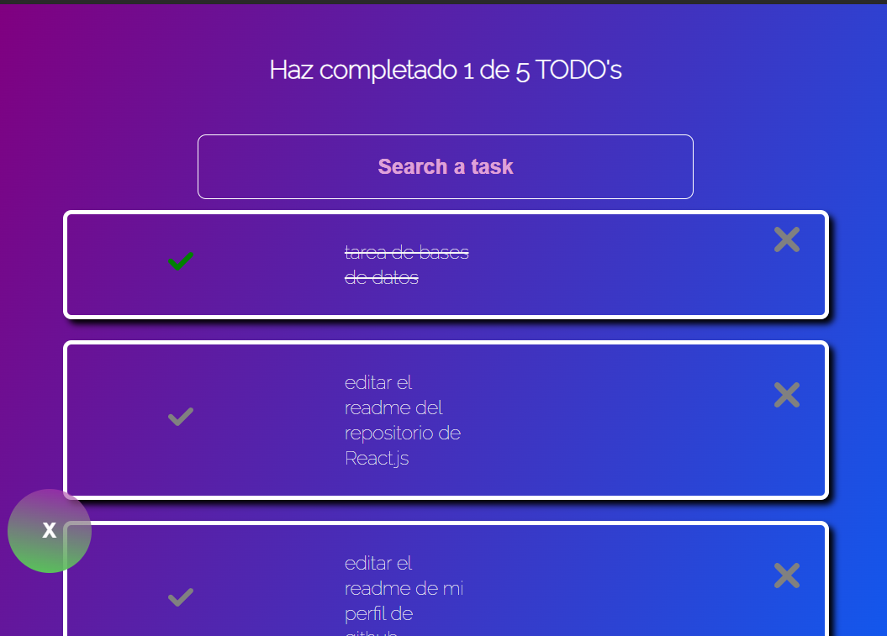

<h1 align="center">TODO  Machine</h1>

This project was developed in React.js using : `create-react-app`, starting from the fundamentals, building up from the components. Subsequently, these components were styled using vanilla CSS, and dynamism was added to different components through states and their manipulation using custom hooks. It's worth noting that, for better development and to avoid the 'prop drilling' problem, functions like createContext() and createPortal() were used. The application also features browser cache storage, allowing users to save their tasks and retrieve them whenever needed.

Este proyecto fue desarrollado en React.js, partiendo desde los fundamentos, comenzando por los componentes. Posteriormente, estos fueron estilizados con CSS vanilla y se añadió dinamismo a los diferentes componentes mediante estados y la manipulación de estos mismos desde custom hooks. Cabe resaltar que, para un mejor desarrollo y para evitar el problema de 'prop drilling', se utilizaron las funciones createContext() y createPortal(). La aplicación también cuenta con almacenamiento en la caché del navegador, de modo que cuando el usuario la utilice, pueda guardar sus tareas y recuperarlas en cualquier momento.

## Features / Características
- Capability to store data in the browser cache
- Responsive desing
- A search bar for navigating between tasks
- Ability to add and delete tasks
- Capability to determine the total number of tasks as well as the remaining tasks
- The search bar can filter based on whether the letter has an accent or is uppercase
- Adaptable a diferentes dispositivos (diseño responsivo)
- Función para almacenar datos en la memoria caché del navegador
- Incorpora una barra de búsqueda para facilitar la navegación entre las tareas
- Permite la adición y eliminación de tareas de manera sencilla
- Proporciona la capacidad de conocer tanto el número total de tareas como las que aún están pendientes
- La barra de búsqueda tiene la capacidad de filtrar considerando si la letra tiene acento o si es mayúscula